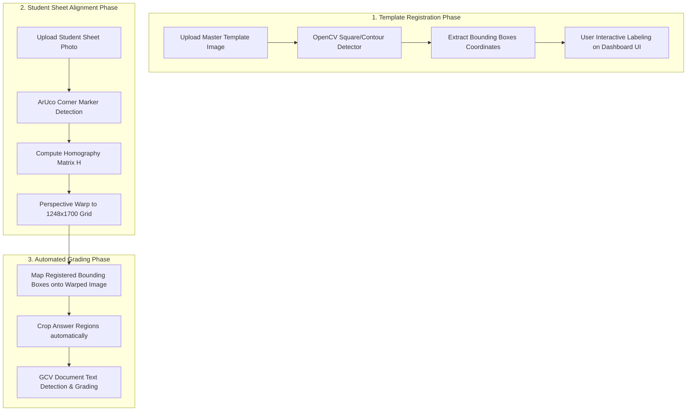

# Implementation Plan: Automated Template Detection & Perspective Warping Pipeline

Instead of manually hardcoding `{ x, y, w, h }` crop coordinates in coordinate system routers, we will design an automated **Computer Vision & Deep Learning Pipeline** that automatically analyzes uploaded sheet templates, aligns student worksheets, and detects/grades handwritten answer regions dynamically.

---

## 🏗️ State-of-the-Art Architecture Workflow



---

## 🛠️ Proposed Engineering Solutions

### 1. Template Registration Phase (Automatic Box Detection)
To eliminate manual coding, we will implement an OpenCV contour-based connected component analyzer in the backend:
*   **Contour Detection:** Apply **Bilateral Filtering**, **Adaptive Thresholding**, and **Canny Edge Detection** on the template image.
*   **Box Filtering:** Extract and filter contours that have:
    *   Rectangular aspect ratios (width/height ratio between `1.0` and `2.0`).
    *   Area dimensions consistent with standard written answer boxes (e.g. between `5,000` and `25,000` pixels).
*   **Registration API:** Save the automatically detected bounding boxes to the database as a template schema, completely avoiding code-level template files!

### 2. Sheet Alignment Phase (Perspective Homography)
To handle skewed, rotated, or unevenly photographed student sheets, we use perspective warping:
*   **Marker Tracking:** Detect the four custom ArUco corner markers (`DICT_4X4_50`) placed at the extreme outer borders of the sheets.
*   **Warping Engine:** 
    ```python
    # Source points from detected ArUco corners
    src_pts = np.float32([corners[0], corners[1], corners[2], corners[3]])
    # Target grid dimensions (1248 x 1700)
    dst_pts = np.float32([[0, 0], [1248, 0], [1248, 1700], [0, 1700]])
    # Compute homography and warp perspective
    H, _ = cv2.findHomography(src_pts, dst_pts)
    warped_image = cv2.warpPerspective(image, H, (1248, 1700))
    ```
*   **Result:** The warped student image aligns **perfectly (pixel-by-pixel)** to the master template coordinates, eliminating all photo-taking angles!

### 3. Model Training & Character Recognition (GCV / Custom CRNN)
*   **OCR Model Training:** Utilize **Google Cloud Vision (GCV) Document Text Detection API** specialized in diverse children's handwriting styles.
*   **Transfer Learning (Optional):** Train a lightweight **CRNN (Convolutional Recurrent Neural Network) with CTC Loss** on children's handwriting datasets (like IAM Handwriting) to further optimize local single-character recognition accuracy.
